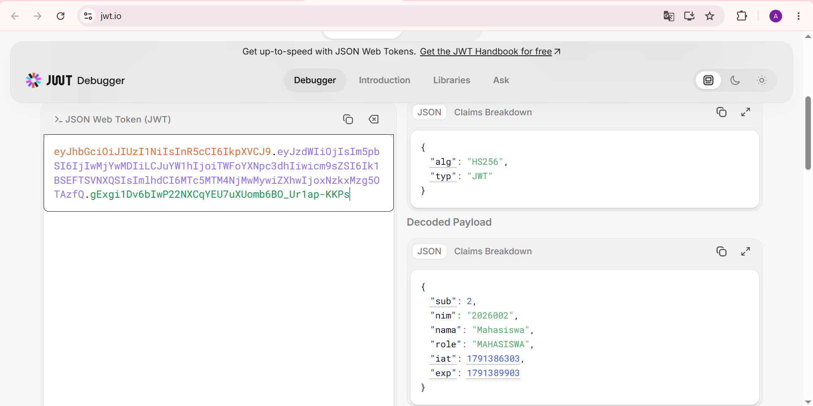
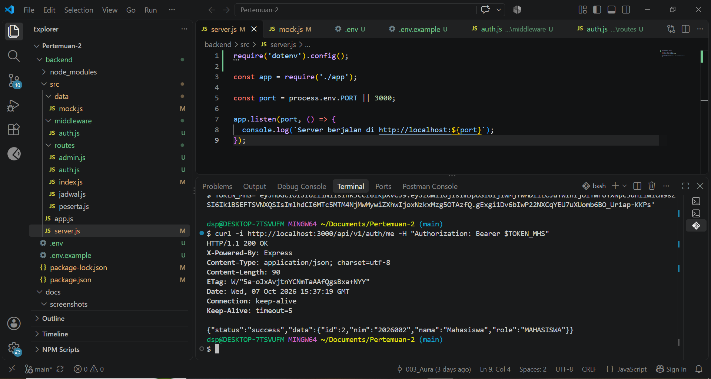
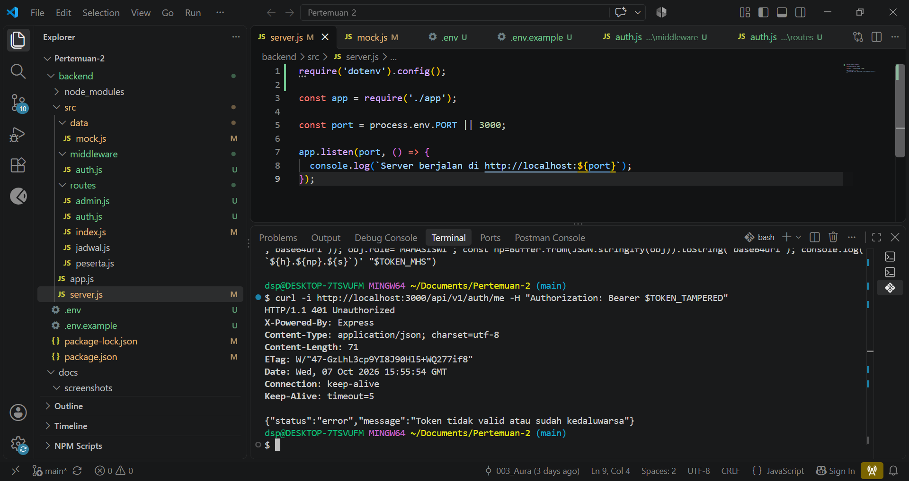

# Tugas Mandiri 4 - JWT

## 1. Login dan Mendapatkan Token JWT
Saya melakukan login menggunakan akun mahasiswa yang telah disediakan pada praktikum, yaitu NIM `2026002` dengan password `mhs123`. Login dilakukan melalui endpoint `POST /api/v1/auth/login`. Hasil login berhasil dan server memberikan token JWT yang kemudian digunakan untuk melakukan pengujian endpoint yang membutuhkan authentication. Token lengkap tidak dicantumkan dalam laporan untuk menjaga keamanan token.


## 2. Mengamati Isi Payload JWT
Token JWT yang diperoleh kemudian diperiksa menggunakan jwt.io. Dari hasil pemeriksaan, token memiliki tiga bagian yaitu header, payload, dan signature. Header token menggunakan algoritma `HS256` dengan tipe `JWT`.



Payload yang diperoleh berisi informasi sebagai berikut:

```json
{
  "sub": 2,
  "nim": "2026002",
  "nama": "Mahasiswa",
  "role": "MAHASISWA",
  "iat": 1791386303,
  "exp": 1791389903
}
```

Pada laporan, token lengkap pada bagian Encoded Token tidak ditampilkan untuk menjaga keamanan token.


## 3. Analisis Claim pada JWT
Claim yang digunakan untuk mengidentifikasi user adalah `sub`. Pada token yang diperoleh, nilai `sub` adalah `2`, yang merupakan ID user. Selain itu terdapat claim `nim` dengan nilai `2026002` yang menunjukkan identitas mahasiswa berdasarkan NIM.

Claim yang digunakan untuk menunjukkan role user adalah `role`. Pada token yang diperoleh, nilai `role` adalah `MAHASISWA`. Claim tersebut digunakan oleh server untuk mengetahui role dan hak akses user.

Claim `iat` menunjukkan waktu ketika token diterbitkan atau dibuat, sedangkan claim `exp` menunjukkan waktu ketika token akan kedaluwarsa. Pada token yang diperoleh, nilai `iat` adalah `1791386303` dan nilai `exp` adalah `1791389903`.

Selisih kedua nilai tersebut adalah 3600 detik atau 1 jam. Hal ini sesuai dengan konfigurasi `JWT_EXPIRES_IN=1h`.


## 4. Mengubah Payload Tanpa Mengubah Signature
Untuk melakukan pengujian, saya membuat token yang telah diubah dengan mengubah satu karakter pada bagian payload, yaitu mengubah nilai claim `role` dari `MAHASISWA` menjadi `MAHASISWI`. Perubahan tersebut dilakukan tanpa membuat ulang signature.

Token yang telah diubah kemudian digunakan untuk mengakses endpoint `GET /api/v1/auth/me`.

Hasil pengujian menunjukkan:

```text
HTTP/1.1 401 Unauthorized
```

dengan respons:

```json
{
  "status": "error",
  "message": "Token tidak valid atau sudah kedaluwarsa"
}
```

Perubahan payload menyebabkan verifikasi signature gagal karena signature JWT dibuat berdasarkan header dan payload asli. Ketika payload diubah tetapi signature tetap menggunakan signature lama, isi token tidak lagi sesuai dengan signature yang dibuat sebelumnya. Ketika server melakukan verifikasi menggunakan `jwt.verify()`, signature tidak cocok dengan header dan payload yang baru sehingga verifikasi token gagal. Server kemudian menolak token dan memberikan respons `401 Unauthorized`.


## 5. Hasil Pengujian GET /auth/me
Pengujian `GET /api/v1/auth/me` dilakukan menggunakan token asli dan token yang telah diubah. Hasil pengujian adalah sebagai berikut:

| No. | Token | Endpoint | Hasil |
|---|---|---|---|
| 1 | Token asli | `GET /api/v1/auth/me` | `200 OK` |
| 2 | Token yang payload-nya diubah | `GET /api/v1/auth/me` | `401 Unauthorized` |

Pengujian menggunakan token asli menghasilkan `200 OK`. Hal tersebut menunjukkan bahwa token asli masih valid dan berhasil diverifikasi oleh server.



Pengujian menggunakan token yang payload-nya telah diubah tanpa memperbarui signature menghasilkan `401 Unauthorized`. Hal tersebut menunjukkan bahwa server berhasil mendeteksi bahwa token telah mengalami perubahan dan signature tidak lagi valid.




## Kesimpulan
Berdasarkan pengujian yang dilakukan, JWT menyimpan informasi user pada bagian payload, seperti `sub`, `nim`, `nama`, dan `role`. Claim `iat` digunakan untuk menunjukkan waktu token diterbitkan, sedangkan `exp` menunjukkan waktu token kedaluwarsa.

Pengujian juga membuktikan bahwa perubahan payload tanpa membuat ulang signature menyebabkan token tidak dapat diverifikasi oleh server. Token asli berhasil digunakan untuk mengakses `GET /api/v1/auth/me` dengan hasil `200 OK`, sedangkan token yang telah diubah menghasilkan `401 Unauthorized`.

Dengan demikian, signature JWT berfungsi untuk memastikan bahwa isi token tidak mengalami perubahan setelah token diterbitkan.