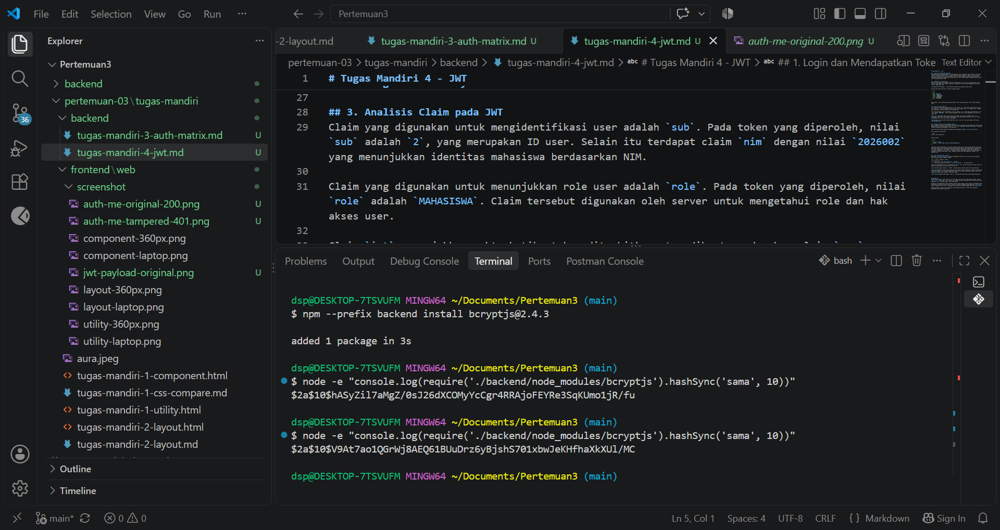
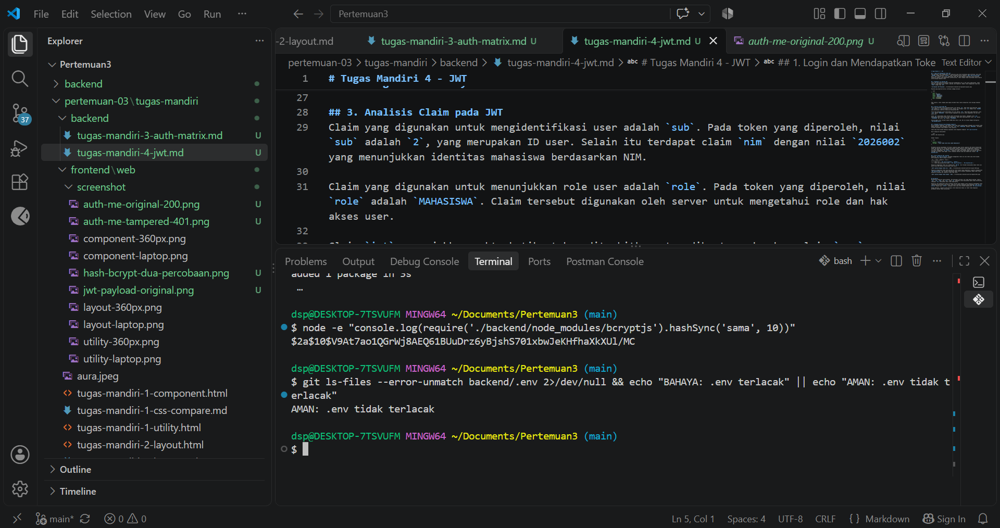
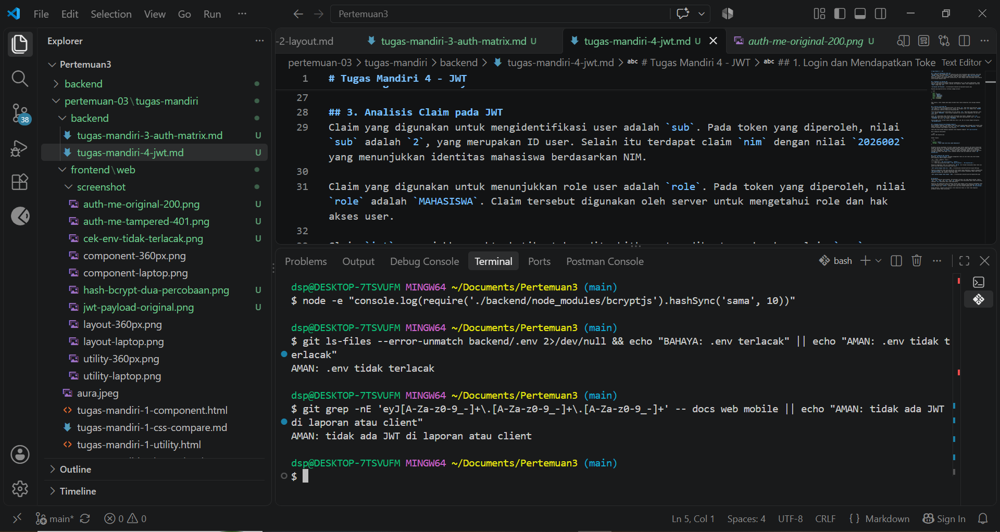

# Tugas Mandiri 5 — Membandingkan Hashing dan Enkripsi serta Menjaga Kunci Rahasia

## 1. Percobaan Hashing dengan bcrypt
Pada percobaan ini dilakukan hashing terhadap kata sandi `sama` menggunakan `bcryptjs` dengan cost `10`. Perintah yang digunakan adalah:

    node -e "console.log(require('./backend/node_modules/bcryptjs').hashSync('sama', 10))"

Perintah tersebut dijalankan sebanyak dua kali dengan kata sandi yang sama. Hasil percobaan pertama adalah:

`$2a$10$hASyZil7aMgZ/0sJ26dXCOMyYcCgr4RRAjoFEYRe3SqKUmo1jR/fu`

Hasil percobaan kedua adalah:

`$2a$10$V9At7ao1QGrWj8AEQ61BUuDrz6yBjshS701xbwJeKHfhaXkXUl/MC`

Kedua percobaan menggunakan kata sandi yang sama, tetapi menghasilkan nilai hash yang berbeda. Hal ini terjadi karena bcrypt menggunakan salt, yaitu nilai acak yang digunakan dalam proses hashing. Setiap proses hashing menggunakan salt yang berbeda sehingga hasil hash juga berbeda meskipun kata sandi yang digunakan sama.

Pada percobaan ini digunakan cost `10`. Cost menentukan tingkat biaya komputasi yang digunakan dalam proses hashing. Semakin tinggi nilai cost, semakin banyak proses komputasi yang diperlukan sehingga waktu pemrosesan menjadi lebih lama.

## 2. Perbedaan Hashing dan Enkripsi
- Hashing mengubah data menjadi nilai hash dan tidak menyediakan proses untuk mengembalikan nilai hash tersebut menjadi data asli. Sementara itu, enkripsi mengubah data menjadi bentuk terenkripsi yang dapat dikembalikan ke data asli melalui proses dekripsi menggunakan kunci yang sesuai.

- Aplikasi menyimpan hash kata sandi agar kata sandi asli pengguna tidak perlu disimpan. Saat pengguna melakukan login, kata sandi yang dimasukkan dapat dibandingkan dengan hash yang tersimpan sehingga aplikasi tetap dapat melakukan verifikasi tanpa menyimpan kata sandi asli.

- `bcrypt.compare` memeriksa kecocokan kata sandi dengan menggunakan kata sandi yang dimasukkan pengguna dan hash yang tersimpan. Bcrypt membaca informasi salt dan cost dari hash tersebut, kemudian melakukan proses hashing terhadap kata sandi masukan dan membandingkan hasilnya dengan hash yang tersimpan.

- Rainbow table adalah tabel yang berisi hash yang telah dihitung sebelumnya dari berbagai kemungkinan kata sandi. Salt mengurangi efektivitas rainbow table karena kata sandi yang sama dapat menghasilkan hash yang berbeda ketika menggunakan salt yang berbeda.

- Menjaga Kerahasiaan JWT_SECRET
`JWT_SECRET` merupakan kunci rahasia yang digunakan untuk membuat dan memverifikasi signature JWT. Nilai tersebut harus dijaga kerahasiaannya karena jika diketahui pihak lain, kunci tersebut dapat disalahgunakan untuk membuat token JWT yang dapat diterima oleh server.

`JWT_SECRET` juga tidak boleh disimpan dalam repository atau riwayat Git. Penyimpanan kunci rahasia di dalam riwayat Git dapat menyebabkan kunci tetap dapat ditemukan meskipun file tersebut kemudian dihapus dari repository.

## 3. Pemeriksaan Berkas Rahasia dan Token JWT
Untuk memastikan bahwa `backend/.env` tidak terlacak oleh Git, dilakukan pemeriksaan menggunakan perintah:

    git ls-files --error-unmatch backend/.env 2>/dev/null && echo "BAHAYA: .env terlacak" || echo "AMAN: .env tidak terlacak"

Hasil pemeriksaan:

    AMAN: .env tidak terlacak

Hasil tersebut menunjukkan bahwa berkas `backend/.env` tidak sedang dilacak oleh Git.

Selanjutnya dilakukan pemeriksaan untuk mengetahui apakah terdapat token JWT lengkap pada laporan atau kode client yang diperiksa menggunakan perintah:

    git grep -nE 'eyJ[A-Za-z0-9_-]+\.[A-Za-z0-9_-]+\.[A-Za-z0-9_-]+' -- docs web mobile || echo "AMAN: tidak ada JWT di laporan atau client"

Hasil pemeriksaan:

    AMAN: tidak ada JWT di laporan atau client

Hasil tersebut menunjukkan bahwa tidak ditemukan token JWT lengkap pada berkas laporan atau client yang diperiksa.

## 5. Kesimpulan
Berdasarkan percobaan yang dilakukan, kata sandi `sama` menghasilkan dua nilai hash yang berbeda meskipun kata sandi yang digunakan sama. Perbedaan tersebut disebabkan oleh penggunaan salt acak pada setiap proses hashing bcrypt. Cost `10` menentukan tingkat biaya komputasi yang digunakan dalam proses hashing sehingga memengaruhi waktu pemrosesan.

Hashing berbeda dengan enkripsi karena hashing tidak ditujukan untuk mengembalikan data asli, sedangkan enkripsi dapat dikembalikan melalui proses dekripsi menggunakan kunci yang sesuai. Dalam penyimpanan kata sandi, aplikasi menggunakan hash agar kata sandi asli tidak perlu disimpan dan `bcrypt.compare` dapat digunakan untuk memeriksa kecocokan kata sandi saat login.

Selain itu, `JWT_SECRET` harus dijaga kerahasiaannya karena digunakan untuk membuat dan memverifikasi signature JWT. Hasil pemeriksaan menunjukkan bahwa `backend/.env` tidak terlacak oleh Git dan tidak ditemukan token JWT lengkap pada laporan atau client yang diperiksa.